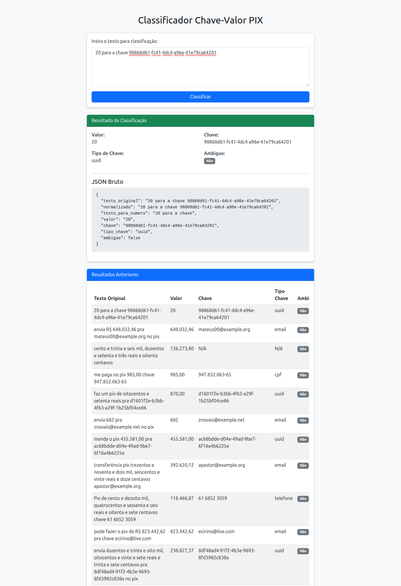

# 🔑 Extrator de PIX (Valor + Chave)

Projeto em **Python** para **extração automática de pedidos de PIX** a partir de texto livre (mensagens informais, WhatsApp, etc.), identificando:

* 💰 **Valor do PIX** (número ou por extenso)
* 🧾 **Chave PIX** (email, CPF, telefone ou UUID)
* ⚠️ **Ambiguidade numérica** (ex: valor e chave igual no texto)

O projeto combina **regex**, **normalização linguística** e **conversão de números por extenso**, além de um **gerador de dataset sintético**.

---



---

## ✨ Funcionalidades

* ✅ Detecta valores em formato brasileiro e americano
* ✅ Converte valores escritos por extenso para número (`"dez reais e cinquenta centavos" → 10.50`)
* ✅ Identifica chaves PIX dos tipos:

  * Email
  * CPF (com validação)
  * Telefone
  * UUID
* ✅ Prioriza automaticamente o tipo de chave mais confiável
* ✅ Detecta ambiguidade

---

## 📦 Estrutura do Projeto

```text
.
├── pix_classifier/              # Pacote da biblioteca
│   ├── classifier.py            # Pipeline principal de extração
│   └── utils/                   # Utilitários de extração e conversão
├── data/
│   ├── generate_dataset.py      # Gerador de dataset sintético
│   ├── run_dataset.py           # Script para processar o dataset
│   ├── dataset.json             # Dataset com mensagens e ground truth
│   ├── resultados.json          # Saída da extração
│   └── validate_results.py      # Validador de acurácia
├── pyproject.toml               # Configuração do pacote Python
└── test.sh                      # Script de teste completo (com auto-venv)
```

---

## 🚀 Exemplo de Uso

Como biblioteca:

```python
from pix_classifier import extrair_pix

texto = "faz um pix de dez reais e cinquenta centavos pra teste@email.com"

resultado = extrair_pix(texto)
print(resultado)
```

### 📤 Saída esperada

```json
{
  "texto_original": "faz um pix de dez reais e cinquenta centavos pra teste@email.com",
  "normalizado": "faz um pix de dez reais e cinquenta centavos pra teste@email.com",
  "texto_para_numero": "faz um pix de 10.50 pra teste@email.com",
  "valor": "10,50",
  "chave": "teste@email.com",
  "tipo_chave": "email",
  "ambiguo": false
}
```

---

## 🧪 Geração de Dataset Sintético

O script `generate_dataset.py` cria milhares de mensagens realistas de PIX com:

* Valores entre **R$ 0,01 e R$ 1.000.000**
* Valores numéricos e por extenso
* Diferentes formatos de chave PIX
* Templates variados de linguagem informal

### Executar:

```bash
python data/generate_dataset.py
```

Isso irá gerar `data/dataset.json`.

---

## 📊 Execução e Validação

Para processar o dataset e validar a acurácia do extrator:

1. **Processar Dataset:**
   ```bash
   python data/run_dataset.py
   ```
   Isso lerá `data/dataset.json` e gerará `data/resultados.json`.

2. **Validar Resultados:**
   ```bash
   python data/validate_results.py
   ```
   O script comparará os resultados obtidos com o gabarito no dataset.

### ⚡ Teste completo (Recomendado)

O projeto inclui um script `test.sh` que facilita todo o processo. Ele **cria e ativa automaticamente um ambiente virtual (venv)** e instala as dependências se necessário antes de rodar os testes.

```bash
bash test.sh
```

Isso também vai subir o servidor na porta 8080

---

## 🛠 Instalação

Para instalar as dependências:
```bash
pip install .
```
ou
```bash
pip install -r requirements.txt
```
